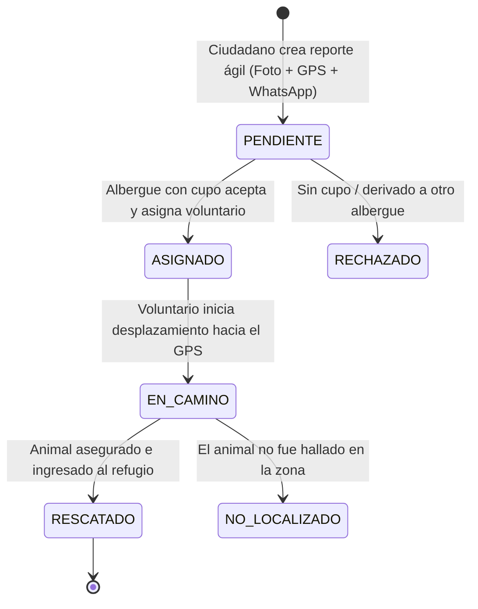
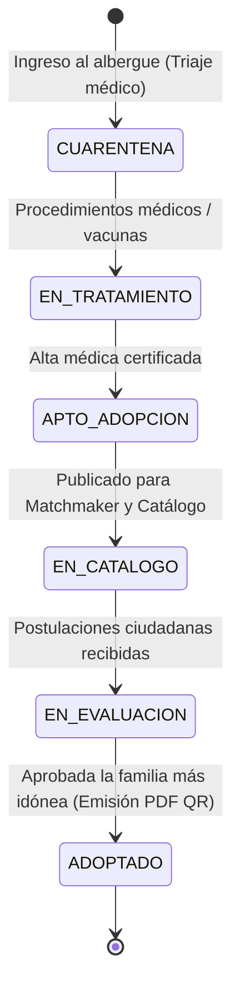

# Arquitectura del Sistema
**RescueLink — Sistema Web de Rescate, Refugio y Adopción de Animales**

---

## 1. Estilo Arquitectónico General

RescueLink implementa una **arquitectura cliente-servidor desacoplada** con una SPA en el frontend (Angular 19+ Standalone + TypeScript) y una API RESTful stateless en el backend (Spring Boot 3.4.x), complementada con un broker de eventos **WebSocket (STOMP)** para notificaciones reactivas y seguimiento en vivo.

El backend adopta principios de **Puertos y Adaptadores (Arquitectura Hexagonal)**, asegurando que los servicios de generación documental, notificaciones y almacenamiento sean completamente intercambiables sin tocar el dominio.

```
                           [ USUARIOS ]
                    ┌───────────┴───────────┐
                    ▼                       ▼
            [ Ciudadano Común ]     [ Albergue / Voluntario ]
             (Sin Auth / Auth)       (Autenticación JWT RBAC)
                    │                       │
                    └───────────┬───────────┘
                                ▼
                 [ FRONTEND SPA (Angular 19+ TS) ]
                   Smart / Dumb (Signals)
                                │
                    HTTPS (REST) + WSS (STOMP)
                                │
    ┌───────────────────────────▼────────────────────────────────────────┐
    │                 BACKEND API (Spring Boot 3.4.x)                   │
    │                                                                    │
    │  [ Controladores REST ] <─── Documentados con Swagger UI / OpenAPI│
    │         │                                                          │
    │         ▼                                                          │
    │  [ Servicios de Dominio (Máquinas de Estado) ]                    │
    │     ├── TicketService (Rescue Tracker + Detección Duplicados)     │
    │     ├── AnimalService (Ciclo Clínico, Matchmaker y Catálogo)       │
    │     ├── SolicitudService (Evaluación Concurrente)                 │
    │     └── AdopcionService (Emisión de Certificados Oficiales)       │
    │         │                                                          │
    │         ├───────────────────────┬──────────────────────┐           │
    │         ▼                       ▼                      ▼           │
    │  [ Repositorios JPA ]    [ StoragePort ]      [ NotificationPort] │
    │         │                [ DocumentGenPort ]                       │
    └─────────┼───────────────────────┼──────────────────────┼───────────┘
              │                       │                      │
      ┌───────┴───────┐       ┌───────┴───────┐      ┌───────┴────────┐
      ▼               ▼       ▼       ▼       ▼      ▼                ▼
[ PostgreSQL 17 ] [ PostGIS ][Cloudi- [MinIO] [Open- [Resend Email /] [WebSocket]
  (3FN + DDL)      (Índices  nary]            PDF]   [Broker STOMP   ]
                    GiST)
```

---

## 2. Máquinas de Estados Finitas

### 2.1 Ciclo de Vida del Ticket de Rescate (`tickets_rescate.estado`)
Soporta la reactividad del **Rescue Tracker** en vivo:


### 2.2 Ciclo de Vida del Animal y Adopción (`animales.estado`)


---

## 3. Endpoints Principales y Desacoplamiento de Caras

| Módulo / Cara | Endpoint REST | Método | Descripción y Lógica |
|---|---|---|---|
| **Pública** | `/api/tickets/reportar` | `POST` | Reporte ágil con Nombre y WhatsApp. Retorna código de seguimiento (`trackingCode`). |
| **Pública** | `/api/tickets/tracking/{codigo}` | `GET` | Consulta del timeline del **Rescue Tracker**. Retorna timestamps y estado actual. |
| **Pública** | `/api/animales/adopcion` | `GET` | Catálogo Híbrido con soporte para filtros de compatibilidad (**Matchmaker**) y geolocalización GPS. |
| **Pública** | `/api/historias-felices` | `GET` | Feed público de casos de éxito con imágenes comparativas Antes/Después. |
| **Pública** | `/api/adopciones/verificar/{codigoQr}`| `GET` | Validación pública de la autenticidad del Certificado Digital de Adopción. |
| **Pública** | `/api/albergues` | `GET` | Directorio geográfico con ubicaciones, capacidad y necesidades de donación. |
| **Privada** | `/api/admin/solicitudes/{id}/aprobar` | `POST` | Transacción atómica: aprueba adopción, cierra postulaciones restantes y emite certificado. |
| **Privada / Pública**| `/api/adopciones/{id}/certificado-pdf` | `GET` | Generación dinámica de documento PDF oficial con código QR embebido vía `DocumentGeneratorPort`. |

---

## 4. Patrones de Diseño Arquitectónicos

1. **Puertos y Adaptadores (Arquitectura Hexagonal):**
   - `StoragePort`: Abstracción para subida de fotos (`CloudinaryStorageAdapter` en producción / `MinIOStorageAdapter` en desarrollo).
   - `NotificationPort`: Abstracción para notificaciones externas (`ResendEmailAdapter` para correos transaccionales y `StompWebSocketAdapter` para el Rescue Tracker).
   - `DocumentGeneratorPort`: Abstracción para la creación del Certificado Oficial (`OpenPdfAdapter` con generación de códigos QR vectoriales).
2. **Repository & DTO Pattern:** Desacoplamiento estricto entre entidades JPA y contratos de transferencia JSON.
3. **Auditable Entity & Soft-Delete Pattern:** Trazabilidad obligatoria (`created_at`, `updated_at`, `created_by`) y borrado lógico inmutable vía `@SQLDelete` y `@SQLRestriction("deleted_at IS NULL")`.
4. **Smart-Dumb Components Pattern + Signals (Frontend):** Vistas y componentes Standalone en Angular 19+ con reactividad declarativa basada en Signals, flujo unidireccional y carga diferida con bloques `@defer`.
5. **RFC 7807 Problem Details:** Estandarización de errores HTTP vía `@RestControllerAdvice`.
