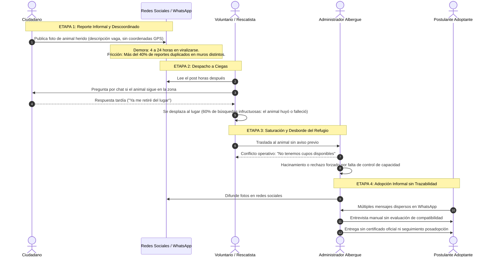

# 🖥️ RescueLink — Sustentación Oficial APF1
## Sistema de información web para la coordinación, seguimiento espacial y gestión de adopciones de animales en riesgo
**Curso Integrador II: Software (100000S12F) — Ciclo 2026-2**  
**Grupo 4:** Diego Claros · Pedro Cueto · Anghelo Mendoza · Elsa Riquelme  
**Incremento evaluado:** Hito 1 (APF1 - Arquitectura de Software y Front-End MVP)

[](https://angular.dev/)
[](https://www.typescriptlang.org/)
[](https://developer.chrome.com/docs/lighthouse/)
[](https://www.w3.org/WAI/standards-guidelines/wcag/)
[](https://www.figma.com/make/1zxQe5KPlpvTQizYrOPFLe/RescueLink-accessible-pet-adoption-site?t=TP9UcGP7XE97F57B-20&fullscreen=1)

---

## Portada Institucional y Organización del Equipo
**Capítulo 1: Alineación y Organización del Equipo (Team Charter)**

### 1.1 Identificación del Proyecto
* **Nombre Oficial:** *RescueLink — Sistema de información web para la coordinación, seguimiento espacial y gestión de adopciones de animales en riesgo*.
* **Institución:** Universidad Tecnológica del Perú (UTP) · Facultad de Ingeniería de Sistemas.
* **Curso:** Curso Integrador II: Software (100000S12F) · Semestre Académico 2026-2.

### 1.2 Estructura del Equipo de Ingeniería y Roles Scrum
Distribución simétrica de responsabilidades técnicas y operativas con trazabilidad total en GitHub:

| Integrante | Rol Scrum Principal | Módulo Funcional Asignado | Historia Sprint 1 (APF1) | Responsabilidad Técnica Clave |
|---|---|---|:---:|---|
| **Diego Claros** | **Scrum Master & Lead Architect** | Módulo 1: Reporte Ciudadano | **HU01** (8 SP) | Arquitectura base Angular, ADRs y captura de coordenadas GPS. |
| **Pedro Cueto** | **Product Owner Simulado** | Módulo 2: Rescue Tracker | **HU02** (5 SP) | Backlog maestro, requerimientos BDD, cronograma Gantt y DoD. |
| **Anghelo Mendoza** | **Business Analyst & Developer** | Módulo 3: Catálogo Espacial | **HU03** (5 SP) | Flujo UX, modelo de datos sintéticos y algoritmo Haversine. |
| **Elsa Riquelme** | **QA Lead & UX Developer** | Módulo 4: Matchmaker & Calidad | **HU04** (3 SP + 2 QA) | Prototipado Figma, WCAG 2.1 AA, matriz PMBOK y auditoría WPO. |

### 1.3 Gobernanza del Equipo (Team Charter)
* **Cadencia Ágil:** Sprints bisemanales con sincronizaciones asíncronas diarias (*Daily Scrum*) en Discord y control de issues en GitHub Projects.
* **Toma de Decisiones:** Consenso técnico fundamentado mediante Architecture Decision Records (ADRs). En caso de empate operativo, voto dirimente del Scrum Master.
* **Disciplina de Repositorio:** Modelo Git Flow con ramas protegidas, prohibición de commits directos a `desarrollo-frontend` y revisión por pares obligatoria.

---

## Diagnóstico Empresarial (AS-IS), Documentación de Campo y Causa Raíz
**Capítulo 2: Diagnóstico de la Realidad Empresarial & Capítulo 3: Definición de la Oportunidad**

### 2.1 Metodología de Levantamiento de Información y Documentación de Campo
La definición del problema se sustentó en un proceso riguroso de investigación documental y de campo:
* **Entrevistas Semiestructuradas:** 6 sesiones de 45 minutos con administradores de albergues independientes en Lima Metropolitana (Comas, San Juan de Lurigancho, Surquillo) y rescatistas independientes, documentando cuellos de botella en triaje, capacidad física y descarte de solicitudes.
* **Observación Contextual Sistemática:** Auditoría continua durante 7 días en grupos públicos de rescate animal en redes sociales (Facebook, WhatsApp e Instagram), contabilizando reportes duplicados, tiempo transcurrido hasta el auxilio y quejas por abandono de casos.
* **Benchmarking Competitivo:** Evaluación comparativa frente a plataformas de referencia (Petfinder a nivel internacional, WUF Perú y Huellitas a nivel local), detectando fortalezas en catálogos pero una carencia crítica en la atención georreferenciada de emergencias.
* **Marco Legal y Regulatorio:**
  - **Ley N° 30407 (Ley de Protección y Bienestar Animal - Perú):** Obligatoriedad de promover la tenencia responsable, garantizar la trazabilidad sanitaria y evitar el maltrato por negligencia o hacinamiento.
  - **Ley N° 29733 (Ley de Protección de Datos Personales - Perú):** Resguardo estricto de la privacidad del ciudadano reportante (teléfono y nombre de uso exclusivo para auxilio inmediato).

### 2.2 Matriz de Stakeholders (Poder vs. Interés)
Análisis estratégico de los actores clave del ecosistema de rescate y adopción:

| Stakeholder | Clasificación | Expectativas Principales | Poder | Interés | Estrategia de Gestión |
|---|---|---|:---:|:---:|---|
| **Ciudadano Reportante** | Externo / Usuario Final | Reportar un animal herido en < 30 s sin registros forzados y recibir confirmación del auxilio. | Bajo | Alto | Mantener informado / UX sin fricción |
| **Familia Adoptante** | Externo / Usuario Final | Conocer mascotas compatibles con su tipo de hogar y acceder a fichas sanitarias transparentes. | Bajo | Alto | Mantener satisfecho / Compatibilidad guiada |
| **Rescatista / Voluntario** | Interno / Operativo | Alertas con GPS exacto, fotos claras y confirmación de albergue receptor para no trasladarse en vano. | Medio | Alto | Gestionar de cerca / Co-diseño operativo |
| **Administrador de Albergue** | Interno / Gestión | Evitar el hacinamiento crítico, controlar la capacidad física y evaluar solicitudes con rigor. | Alto | Alto | Socio clave / Involucramiento total |
| **Municipalidades / SERFOR** | Regulatorio / Gubernamental | Fomentar la salud pública, control de rabia y zoonosis, y cumplimiento de la Ley 30407. | Alto | Bajo | Mantener satisfecho / Cumplimiento normativo |

### 2.3 Mapeo del Proceso Actual (AS-IS) y Puntos Críticos de Fricción


### 2.4 Análisis de Causa Raíz: Técnica de los "5 Porqués"
1. **¿Por qué los animales heridos en la calle no son auxiliados oportunamente?**  
   *Porque los albergues y rescatistas se enteran horas o días después mediante publicaciones desordenadas en redes sociales.*
2. **¿Por qué se enteran tarde mediante redes sociales?**  
   *Porque no existe un canal directo centralizado que conecte al ciudadano con el albergue disponible más cercano en tiempo real.*
3. **¿Por qué el ciudadano acude a redes sociales y no a un canal directo?**  
   *Porque las plataformas existentes exigen registros engorrosos, formularios extensos o no capturan la ubicación GPS exacta.*
4. **¿Por qué el ciudadano pierde interés en dar seguimiento al animal?**  
   *Porque nadie le informa si alguien fue a buscarlo, asumiendo con frustración que su alerta fue ignorada.*
5. **¿Por qué las organizaciones no informan al reportante ni coordinan eficazmente?**  
   👉 **CAUSA RAÍZ:** *Porque carecen de un sistema de información web operativo centralizado que gestione el ciclo de vida del rescate mediante geolocalización en tiempo real, estados transparentes y trazabilidad pública.*

---

## Delimitación del MVP, Matriz de Alcance y Decisiones Arquitectónicas (ADRs)
**Capítulo 3: Delimitación del MVP & Capítulo 7: Selección y Justificación Tecnológica (ADRs)**

### 3.1 Definición de la Oportunidad y Product Goal
* **Enunciado de la Oportunidad:** Reducir el tiempo de reporte a menos de 30 segundos, eliminar el despacho a ciegas de rescatistas mediante georreferenciación y transparentar el rescate y adopción de animales vulnerables.
* **Product Goal (Hito APF1):**  
  > *"Construir y desplegar un sistema web accesible, responsivo y de alto rendimiento que capture reportes georreferenciados de animales en riesgo en menos de 30 segundos sin fricción de registro, proporcione seguimiento reactivo en vivo y permita explorar mascotas en adopción ordenadas por cercanía física."*

### 3.2 Matriz de Alcance: In-Scope vs. Out-of-Scope (MVP APF1 vs. Hitos Posteriores)

| Capacidades Incluidas en el Alcance (In-Scope - APF1) | Capacidades Excluidas de esta Versión (Out-of-Scope) | Hito de Incorporación |
|---|---|:---:|
| Formulario de reporte ágil ciudadano con captura automática de GPS y vista previa de foto. | Pasarela de pagos bancarios reales para donaciones monetarias. | Hito 4 (PROY) |
| Línea de tiempo reactiva (*Rescue Tracker*) con visualización de estados en tiempo real. | Aplicación móvil nativa en tiendas Google Play / App Store (foco en Web Responsive). | Fuera del alcance |
| Catálogo de adopción filtrable con ordenamiento esférico por proximidad (*"Cerca de mí"*). | Algoritmo de ruteo vehicular multi-parada en tiempo real para patrullas. | Hito 4 (PROY) |
| Test interactivo de compatibilidad en 3 pasos (*Matchmaker de Adopción*). | Reconocimiento biométrico facial o de pelaje por Inteligencia Artificial. | Fuera del alcance |
| Directorio visual de albergues con indicador de capacidad disponible y datos de contacto. | Gestión de historias clínicas complejas con firma criptográfica PKI. | Hito 3 (APF3) |
| Manejo determinista de 5 estados UI (`idle`, `loading`, `success`, `empty`, `error`) con datos sintéticos locales. | Conexión a base de datos persistente concurrente (Spring Boot + PostgreSQL/PostGIS). | Hito 2 (APF2) |

### 3.3 Supuestos y Restricciones del Proyecto
* **Supuesto Clave:** El 90% de los ciudadanos que reportan en la calle utilizan navegadores móviles con sensor GPS operativo (Chrome Mobile, Safari).
* **Restricción de Usabilidad:** Operabilidad estricta y adaptable desde pantallas mínimas de **320 px** de ancho sin desbordamiento horizontal.
* **Restricción de Rendimiento:** Calificación de rendimiento WPO en Google Lighthouse Mobile $\ge 85/100$.

### 3.4 Decisiones de Arquitectura de Software (ADRs)

#### ADR-001: Selección del Framework Front-End (Matriz Multicriterio Ponderada)
Evaluación técnica formal de alternativas para el cliente web:

| Criterio de Evaluación | Peso (%) | Angular 19+ Standalone | React 19 + Vite | Vue 3 + Pinia |
|---|:---:|:---:|:---:|:---:|
| Arquitectura Empresarial Integrada Out-of-the-box | 30% | **5.0** (1.50) | 4.0 (1.20) | 4.0 (1.20) |
| Gestión de Estado Nativo Reactivo (Signals) | 25% | **5.0** (1.25) | 4.0 (1.00) | 4.5 (1.13) |
| Curva de Aprendizaje y Ecosistema | 20% | 4.0 (0.80) | **5.0** (1.00) | 4.5 (0.90) |
| Rendimiento y WPO Nativo (`@defer`, `NgOptimizedImage`) | 15% | **5.0** (0.75) | 4.5 (0.68) | 4.0 (0.60) |
| Soporte Nativo Estricto de TypeScript | 10% | **5.0** (0.50) | 4.7 (0.47) | 4.5 (0.45) |
| **PUNTUACIÓN FINAL PONDERADA** | **100%** | **4.80 / 5.00** | **4.35 / 5.00** | **4.28 / 5.00** |

* **Decisión:** Selección de **Angular Standalone con TypeScript estricto**. Justificado por su cohesión estructural, optimizaciones de rendimiento integradas en el compilador (`@defer`) y reactividad granular mediante Signals sin dependencias de terceros.
* **ADR-002 (Gestión de Estado):** Adopción de **Angular Signals** en lugar de NgRx/Redux. Reduce el código boilerplate en un 70%, ofrece reactividad precisa nodo a nodo sin disparar ciclos globales de Zone.js.
* **ADR-003 (Persistencia y Backend Futuro):** Adopción de **Spring Boot 3 + PostgreSQL + PostGIS** para la Unidad 2 (APF2), asegurando soporte nativo para funciones geoespaciales (`ST_DWithin`, `ST_Distance`).

---

## Catálogo Formal de Requerimientos (RF, RNF y Reglas de Negocio)
**Capítulo 4: Elicitación de Requerimientos e Historias de Usuario**

### 4.1 Requerimientos Funcionales (RF)
* **RF01 (Reporte Ágil de Emergencia):** El sistema debe permitir al usuario enviar un reporte de emergencia ingresando nombre, WhatsApp, fotografía del animal y captura de coordenadas GPS del dispositivo.
* **RF02 (Rescue Tracker en Vivo):** El sistema debe permitir consultar la línea de tiempo del rescate ingresando el código único de ticket alfanumérico generado.
* **RF03 (Catálogo Geodésico de Adopción):** El sistema debe presentar un catálogo de adopción filtrable por especie, tamaño y cercanía geográfica respecto a la posición actual del usuario calculada por fórmula esférica.
* **RF04 (Asistente Matchmaker de Compatibilidad):** El sistema debe incorporar un asistente interactivo de 3 preguntas que filtre las mascotas según el estilo de vida y vivienda del adoptante.
* **RF05 (Directorio Geográfico de Albergues):** El sistema debe desplegar un directorio de albergues con su ubicación, datos de contacto y semáforo de disponibilidad de cupos.
* **RF06 (Detección Preventiva de Duplicados):** El sistema debe detectar automáticamente posibles reportes duplicados dentro de un radio espacial de 50 metros registrados en las últimas 2 horas.
* **RF07 (Postulación Formal a Adopción):** El sistema debe permitir a las familias adoptantes postular a la adopción de una mascota completando un formulario de idoneidad y compromiso ético.
* **RF08 (Muro de Evidencia Social - Finales Felices):** El sistema debe presentar un muro de testimonios con un componente slider comparativo interactivo Antes vs. Después.

### 4.2 Requerimientos No Funcionales (RNF)
* **RNF01 (Rendimiento Front-End / WPO):** El Largest Contentful Paint (LCP) en navegación móvil 4G simulada debe ser menor a **2.5 segundos** y el Cumulative Layout Shift (CLS) inferior a **0.1**.
* **RNF02 (Accesibilidad Web WCAG 2.1 AA):** Toda la interfaz debe cumplir con las directrices WCAG 2.1 nivel AA, garantizando un ratio de contraste mínimo de **4.5:1** y navegación íntegra por teclado.
* **RNF03 (Diseño Responsivo Mobile-First):** La aplicación debe adaptarse de manera fluida desde un ancho mínimo de **320 px** hasta pantallas 4K sin generar desbordamiento ni scroll horizontal.
* **RNF04 (Manejo de Estados Determinista):** Cada vista interactiva debe manejar de forma tipada e inequívoca los estados de interfaz: `idle`, `loading`, `success`, `empty` y `error`.

### 4.3 Reglas de Negocio Formales (RN)
* **RN01 (Reporte sin Barreras):** No se exigirá inicio de sesión ni creación de cuenta previa para registrar una emergencia en la vía pública.
* **RN02 (Control de Sobrecupo en Albergues):** Un albergue cuya capacidad activa alcance el 100% no podrá recibir nuevas asignaciones automáticas de rescate.
* **RN03 (Resolución de Solicitudes Concurrentes):** Múltiples usuarios pueden postular al mismo animal; al aprobarse formalmente una adopción, las demás solicitudes asociadas pasan al estado `CERRADA_POR_OTRA_ADOPCION`.
* **RN04 (Umbral Espacial de Duplicados):** Dos reportes ocurridos a menos de **50 metros** de distancia y con una diferencia de tiempo menor a **120 minutos** se consideran presuntos duplicados y disparan una alerta de confirmación.
* **RN05 (Inmutabilidad del Historial Clínico):** Los registros veterinarios y de vacunación son de solo inserción/lectura y no pueden ser eliminados del sistema.
* **RN06 (Privacidad del Ciudadano):** Los datos personales del reportante solo son visibles para el personal asignado al auxilio y se ocultan de las vistas públicas conforme a la Ley 29733.

---

## Product Backlog Maestro (16 Historias de Usuario) y Planificación Sprint 1
**Capítulo 5: Priorización y Planificación Ágil (Scrum)**

### 5.1 Matriz Maestra del Product Backlog Semestral (16 Historias · 55 Story Points)
Distribución equitativa: exactamente **4 Historias de Usuario por integrante** (1 HU por hito evaluativo):

| ID | Historia de Usuario | Integrante Responsable | Hito Evaluativo | Estimación | Prioridad MoSCoW | Rama de Trabajo Git |
|:---:|---|---|:---:|:---:|:---:|---|
| **HU01** | Reporte Ágil con Captura GPS y Foto | **Diego Claros** | **APF1 (Sprint 1)** | **8 SP** | Must Have | `feat/HU-01-reporte-agil-gps` |
| **HU02** | Rescue Tracker de Seguimiento en Vivo | **Pedro Cueto** | **APF1 (Sprint 1)** | **5 SP** | Must Have | `feat/HU-02-rescue-tracker` |
| **HU03** | Catálogo Ordenado por Proximidad GPS | **Anghelo Mendoza** | **APF1 (Sprint 1)** | **5 SP** | Must Have | `feat/HU-03-catalogo-cercania-gps` |
| **HU04** | Matchmaker Interactivo de Compatibilidad | **Elsa Riquelme** | **APF1 (Sprint 1)** | **3 SP (+2 QA)** | Should Have | `feat/HU-04-matchmaker-wizard` |
| **HU05** | Detección Preventiva de Duplicados PostGIS | Anghelo Mendoza | APF2 (Sprint 2) | 5 SP | Should Have | `feat/HU-05-deteccion-duplicados` |
| **HU07** | Directorio Geográfico de Albergues Aliados | Elsa Riquelme | APF2 (Sprint 2) | 2 SP | Could Have | `feat/HU-07-directorio-albergues` |
| **HU09** | Autenticación Segura JWT y Roles de Usuario | Diego Claros | APF2 (Sprint 2) | 3 SP | Must Have | `feat/HU-09-auth-jwt-roles` |
| **HU10** | Bandeja Operativa y Asignación de Refugios | Pedro Cueto | APF2 (Sprint 2) | 4 SP | Must Have | `feat/HU-10-bandeja-rescates` |
| **HU06** | Postulación a Adopción con Formulario | Anghelo Mendoza | APF3 (Sprint 3) | 3 SP | Must Have | `feat/HU-06-postulacion-adopcion` |
| **HU11** | Ficha Clínica, Historial Médico y Cuarentena | Elsa Riquelme | APF3 (Sprint 3) | 3 SP | Must Have | `feat/HU-11-ficha-clinica-cuarentena` |
| **HU12** | Control de Capacidad y Alertas de Sobrecupo | Pedro Cueto | APF3 (Sprint 3) | 2 SP | Should Have | `feat/HU-12-control-capacidad` |
| **HU14** | Emisión de Certificado PDF con Código QR | Diego Claros | APF3 (Sprint 3) | 3 SP | Must Have | `feat/HU-14-certificado-pdf-qr` |
| **HU08** | Muro de Finales Felices (Slider Comparativo) | Elsa Riquelme | PROY (Sprint 4) | 2 SP | Could Have | `feat/HU-08-muro-finales-felices` |
| **HU13** | Evaluación Comparativa y Dictamen de Postulantes | Anghelo Mendoza | PROY (Sprint 4) | 2 SP | Should Have | `feat/HU-13-dictamen-adopcion` |
| **HU15** | Despacho y Confirmación Móvil en Campo | Pedro Cueto | PROY (Sprint 4) | 3 SP | Should Have | `feat/HU-15-despacho-voluntarios` |
| **HU16** | Portal Público de Verificación Criptográfica QR | Diego Claros | PROY (Sprint 4) | 2 SP | Could Have | `feat/HU-16-verificacion-qr` |

### 5.2 Planificación del Sprint 1 (APF1): Foco en la Cara Pública sin Fricción
* **Velocidad Comprometida del Sprint 1:** **21 Story Points**.
* **Objetivo del Sprint 1:** Entregar el primer incremento funcional del cliente web, permitiendo reportar emergencias con geolocalización, rastrear el auxilio y explorar adopciones por cercanía con accesibilidad y alto rendimiento.

---

## Especificación BDD (Gherkin) de Historias de Usuario Prioritarias
**Capítulo 4: Requerimientos e Historias de Usuario BDD**

### 6.1 HU01: Reporte Ágil de Emergencia con Ubicación GPS (Diego Claros)
```gherkin
Escenario 1: Reporte exitoso con captura automática de GPS (Happy Path)
  Dado que el ciudadano accede al formulario en "/reportar"
  Y el dispositivo tiene los permisos de geolocalización habilitados
  Cuando ingresa su nombre "Carlos Ruiz", WhatsApp "987654321" y adjunta una foto
  Y presiona el botón "Enviar Reporte de Emergencia"
  Entonces el sistema captura latitud y longitud automáticamente con precisión < 15 m
  Y emite un código de ticket único alfanumérico (ej. "TICK-1024")
  Y redirige de inmediato a la vista de tracking en vivo.

Escenario 2: Fallback manual ante permiso de geolocalización denegado
  Dado que el ciudadano ingresa al formulario con el GPS desactivado
  Cuando el navegador reporta el error "PERMISSION_DENIED"
  Entonces el sistema no bloquea el envío de la emergencia
  Y activa un selector distrital desplegable con opción de posicionamiento manual
  Y marca las coordenadas del centroide distrital con un indicador visual amarillo.
```

### 6.2 HU02: Rescue Tracker de Seguimiento en Vivo (Pedro Cueto)
```gherkin
Escenario 1: Consulta exitosa de ticket válido en curso
  Dado que el usuario accede a la vista "/tracking"
  Cuando ingresa el código "TICK-1024" y hace clic en "Consultar Estado"
  Entonces el sistema renderiza la línea de tiempo reactiva del rescate
  Y muestra el estado actual ("EN_CAMINO"), nombre del albergue y hora estimada de llegada.

Escenario 2: Consulta de código de ticket inexistente
  Dado que el usuario consulta un código no registrado en el sistema
  Cuando se completa la búsqueda
  Entonces el sistema muestra una pantalla amigable de estado vacío (Empty State)
  Y proporciona un botón para verificar el código o iniciar un nuevo reporte.
```

### 6.3 HU03: Catálogo de Adopción Ordenado por Proximidad (Anghelo Mendoza)
```gherkin
Escenario 1: Ordenamiento geodésico dinámico por cercanía física
  Dado que el usuario se encuentra en el catálogo "/adopcion"
  Y ha compartido su ubicación GPS actual
  Cuando activa el switch "📍 Ordenar por cercanía a mi posición"
  Entonces el sistema calcula la distancia ortodrómica a cada albergue mediante Haversine
  Y ordena la cuadrícula de mascotas en orden ascendente de kilómetros
  Y muestra la etiqueta con la distancia calculada en cada tarjeta (ej. "A 2.4 km de ti").
```

### 6.4 HU04: Asistente Interactivo de Compatibilidad (Elsa Riquelme)
```gherkin
Escenario 1: Adoptante completa el cuestionario de compatibilidad
  Dado que el usuario abre el modal del asistente Matchmaker
  Cuando responde las 3 preguntas (tipo de vivienda, horas fuera de casa y nivel de actividad)
  Entonces el sistema calcula el índice de compatibilidad porcentual [0-100%]
  Y filtra el catálogo mostrando en primer lugar a los animales con afinidad >= 80%.
```

---

## Diseño UX/UI, Prototipo Interactivo en Figma y Validación de Usabilidad
**Capítulo 9: Flujo de Usuario, Prototipado Interactivo y Validación Rápida**

### 7.1 Prototipo Interactivo Oficial en Figma
* **Acceso Directo al Prototipo:**  
  🔗 [https://www.figma.com/make/1zxQe5KPlpvTQizYrOPFLe/RescueLink-accessible-pet-adoption-site?t=TP9UcGP7XE97F57B-20&fullscreen=1](https://www.figma.com/make/1zxQe5KPlpvTQizYrOPFLe/RescueLink-accessible-pet-adoption-site?t=TP9UcGP7XE97F57B-20&fullscreen=1)

### 7.2 Sistema de Diseño y Biblioteca de Componentes UI
* **Tokens de Diseño:** Colores con semántica accesible (Verde `#059669` para estados confirmados, Ámbar `#D97706` para atención pendiente, Rojo `#DC2626` para urgencias críticas).
* **Tipografía:** Jerarquía tipográfica basada en *Outfit* para títulos institucionales e *Inter* para lectura operativa en pantallas móviles.
* **Matriz de Estados de Componentes:** Cada elemento UI interactivo (botones, inputs, cards) cuenta con especificaciones para: `Default`, `Hover`, `Focus-Visible`, `Active`, `Disabled`, `Loading` y `Empty`.

### 7.3 Accesibilidad Universal y Diseño Inclusivo (WCAG 2.1 AA)
* **Contraste de Color:** Ratios de contraste medidos superiores a **5.2:1** en texto normal sobre fondo (superando la exigencia legal de 4.5:1).
* **Navegación por Teclado:** Foco visual evidente (`outline: 3px solid #2563EB`) en todos los controles interactivos, permitiendo operar el 100% de la plataforma sin usar mouse.
* **Compatibilidad con Lectores de Pantalla:** Atributos ARIA (`aria-live="polite"`, `aria-describedby`) en la captura de GPS y en la actualización de estados del tracker.

### 7.4 Validación Temprana: Prueba de Usabilidad de Guerrilla
Evaluación con usuario representativo externo ejecutando 3 tareas críticas en el prototipo Figma:

| Tarea Evaluada | Hallazgo / Fricción Detectada | Corrección de Diseño Aplicada en Front-End |
|---|---|---|
| **1. Reporte en Calle** | El usuario dudaba si el teléfono había capturado el GPS con exactitud. | Se incorporó un **Chip visual de confirmación GPS** que se torna verde con las coordenadas capturadas. |
| **2. Consulta de Tracker** | Dificultad para memorizar el código alfanumérico del ticket generado. | Se implementó un **Botón de copiado en un clic** del ticket con feedback visual (*"¡Copiado!"*). |
| **3. Exploración de Adopción** | No se distinguía qué albergue albergaba a la mascota ni la lejanía. | Se añadió la **Etiqueta destacada de distancia en km** y nombre del albergue en la tarjeta. |

---

## Flujo de Usuario (User Flow) y Algoritmo Geodésico Espacial (Haversine)
**Capítulo 9: Flujo de Usuario & Capítulo 11: Primer Incremento Front-End**

### 8.1 Diagrama del Flujo de Usuario (User Flow)


### 8.2 Fundamento Matemático del Algoritmo Geodésico de Haversine
Para calcular la distancia ortodrómica sobre una superficie esférica entre la coordenada del usuario $(\phi_1, \lambda_1)$ y la del albergue $(\phi_2, \lambda_2)$, se implementa la fórmula esférica de Haversine con un radio terrestre medio $R = 6,371\text{ km}$:

$$\Delta\phi = \phi_2 - \phi_1, \quad \Delta\lambda = \lambda_2 - \lambda_1$$
$$a = \sin^2\left(\frac{\Delta\phi}{2}\right) + \cos(\phi_1)\cos(\phi_2)\sin^2\left(\frac{\Delta\lambda}{2}\right)$$
$$c = 2 \cdot \operatorname{atan2}\left(\sqrt{a}, \sqrt{1-a}\right) \implies d = R \cdot c$$

* **Pureza y Determinismo:** Función pura implementada en TypeScript, sin dependencias externas ni llamadas de red. Permite validación unitaria 100% determinista.
* **Complejidad Temporal:** $O(n \log n)$ al aplicar el ordenamiento dinámico sobre el listado de mascotas en memoria del cliente, garantizando ejecución en $< 5\text{ ms}$.

---

## Arquitectura Front-End Standalone, Smart/Dumb Components y Máquina de Estados
**Capítulo 11: Primer Incremento Front-End (Transformación a Código)**

### 9.1 Paradigma Angular Standalone con Signals
* **Sin `NgModule` Legacy:** Arquitectura 100% modular basada en componentes Standalone (`standalone: true`), reduciendo el tamaño del bundle inicial y permitiendo tree-shaking exhaustivo.
* **Reactividad Nativa con Signals:** Reemplazo de observables complejos de RxJS por primitivos reactivos: `signal()`, `computed()` y `effect()`. Garantiza que los cambios de estado solo actualicen el nodo DOM exacto.

### 9.2 Patrón de Componentes Smart & Dumb (Separación de Responsabilidades)
* **Contenedores Smart (Lógica de Negocio):**  
  Componentes como `CatalogContainerComponent` y `ReportContainerComponent`. Inyectan servicios, manejan llamadas a datos sintéticos, calculan el estado reactivo y gestionan la navegación.
* **Componentes Dumb (Presentacionales y Reutilizables):**  
  Componentes como `PetCardComponent`, `TrackerTimelineComponent`, `GpsBadgeComponent` y `MatchmakerWizardComponent`. No poseen dependencias de servicios; se comunican estrictamente mediante `input()` y emiten eventos al padre mediante `output()`.

### 9.3 Máquina de 5 Estados de Interfaz Determinista
Para asegurar que la pantalla nunca quede en blanco ni muestre comportamientos inconsistentes ante errores, cada vista implementa una unión discriminada en TypeScript:

```typescript
export type UIState<T> =
  | { status: 'idle' }
  | { status: 'loading' }
  | { status: 'success'; data: T }
  | { status: 'empty'; message: string }
  | { status: 'error'; errorMessage: string };
```

* **`idle`:** Estado inicial de reposo antes de que el usuario interactúe.
* **`loading`:** Presentación de esqueletos de carga animados (*skeletons*) sin saltos de layout.
* **`success`:** Renderizado de los datos válidos procesados.
* **`empty`:** Estado sin registros (ej. sin mascotas en el radio geográfico) con guía de acción correctiva.
* **`error`:** Mensajes amigables y botón de reintento (*Retry Pattern*) sin recargar la página.

---

## Gobernanza de Ingeniería en GitHub, Git Flow y Criterios DoD / DoR
**Capítulo 5: Planificación Ágil & Capítulo 8: Configuración del Repositorio y Entorno**

### 10.1 Estructura del Repositorio GitHub (`Integrador2G4`)
* **Organización Limpia:**
  - `ProyectoFinal/frontend/`: Aplicación Angular Standalone con código fuente, assets y tests.
  - `ProyectoFinal/APF-Avances/`: Documentación formal del proyecto e ingeniería de software.
  - `Laboratorios/`: Evidencias individuales de aprendizaje práctico de los 4 integrantes.
  - `Sesiones/`: Presentaciones oficiales de clase y materiales de sustentación por sesión.

### 10.2 Estrategia de Ramas Git Flow y Matriz de Revisión por Pares (Peer Review)
* **Ramas Protegidas:** Ramas `main` (despliegue productivo) y `desarrollo-frontend` (integración continua) protegidas contra commits directos.
* **Matriz Cruzada de Aprobación de Pull Requests:**
  - `Diego Claros` $\rightarrow$ Revisa los PRs de `Pedro Cueto`.
  - `Pedro Cueto` $\rightarrow$ Revisa los PRs de `Anghelo Mendoza`.
  - `Anghelo Mendoza` $\rightarrow$ Revisa los PRs de `Elsa Riquelme`.
  - `Elsa Riquelme` $\rightarrow$ Revisa los PRs de `Diego Claros`.

### 10.3 Criterios de Calidad: Definition of Ready (DoR) vs. Definition of Done (DoD)
* **Definition of Ready (DoR):** Historia con narrativa de usuario, criterios BDD en Gherkin, estimación acordada en Planning, mockup Figma aprobado y dependencias técnicas resueltas.
* **Definition of Done (DoD - 8 Puntos de Control Obligatorios):**
  1. Código TypeScript bajo modo estricto sin uso de `any`.
  2. Implementación de los 5 estados UI deterministas (`idle`, `loading`, `success`, `empty`, `error`).
  3. Pruebas unitarias automatizadas (`npm test`) pasando al 100% de éxito.
  4. Build de producción (`ng build --configuration production`) sin advertencias y dentro de budgets.
  5. Diseño responsivo validado en DevTools a **320 px** sin desbordamiento horizontal.
  6. Cumplimiento de accesibilidad WCAG 2.1 AA (contraste $\ge 4.5:1$ y navegación por teclado).
  7. Pull Request revisado y aprobado por el par asignado en la matriz.
  8. Rama de feature eliminada tras el merge a `desarrollo-frontend`.

---

## Gestión Cuantitativa de Riesgos PMBOK (RBS, Matriz 5x5 y Disparadores)
**Capítulo 10: Gestión Cuantitativa de Riesgos (PMBOK / ISO 31000)**

### 11.1 Estructura de Desglose de Riesgos (RBS - Risk Breakdown Structure)
* **Técnicos:** Incompatibilidad de geolocalización móvil, incremento desmedido del bundle web.
* **Gestión:** Cuellos de botella en revisiones por pares, desalineación con el Product Backlog.
* **Operativos / UX:** Abandono del reporte por lentitud de red, desbordamiento en pantallas pequeñas.
* **Normativos:** Incumplimiento de la Ley 29733 de Protección de Datos Personales.

### 11.2 Mapa de Calor Cuantitativo de Riesgos (Matriz $5 \times 5$)
Evaluación de Probabilidad ($P$) e Impacto ($I$) en escala del 1 al 5:

| Código | Riesgo Identificado | P | I | Severidad ($P \times I$) | Nivel de Riesgo | Estrategia de Respuesta |
|:---:|---|:---:|:---:|:---:|:---:|---|
| **RSK-01** | Fallo en la captura del sensor GPS en navegadores móviles | 3 | 4 | **12** | 🟡 **Alto** | **Mitigar:** Selector distrital manual con centroides precalculados. |
| **RSK-02** | Degradación del rendimiento WPO por bundle excesivo | 3 | 4 | **12** | 🟡 **Alto** | **Mitigar:** Bloques `@defer`, presupuestos estrictos en `angular.json`. |
| **RSK-03** | Inconsistencia de datos por duplicación masiva de reportes | 4 | 3 | **12** | 🟡 **Alto** | **Mitigar:** Regla de negocio RN04 (< 50 m y < 120 min) en backend. |
| **RSK-04** | Desbordamiento horizontal en resoluciones móviles de 320 px | 2 | 4 | **8** | 🟢 **Moderado** | **Prevenir:** CSS Grid flexible, contenedor responsive y padding controlado. |
| **RSK-05** | Retraso en integración por cuellos de botella en Code Reviews | 2 | 3 | **6** | 🟢 **Moderado** | **Controlar:** Matriz de asignación cruzada y límite de 24 h para revisión. |
| **RSK-06** | Vulneración de datos de contacto del ciudadano reportante | 1 | 5 | **5** | 🟢 **Moderado** | **Prevenir:** Exclusión de datos personales de respuestas HTTP públicas. |

### 11.3 Disparadores Automáticos (Triggers) e Issues de GitHub
* **Trigger RSK-01 (Fallo GPS):** Si el navegador retorna `PERMISSION_DENIED` o timeout > 5 s $\rightarrow$ Se dispara la apertura inmediata del selector distrital alternativo (`#issue-12-fallback-gps`).
* **Trigger RSK-02 (Sobrecarga de Bundle):** Si el comando `ng build` supera los 350 kB de bundle inicial $\rightarrow$ El pipeline CI bloquea la integración automáticamente hasta aplicar `@defer` (`#issue-18-bundle-budget`).

---

## Métricas de Negocio (KPIs), Métricas Técnicas (SLIs) y Acuerdos de Nivel de Servicio (SLA)
**Capítulo 12: Métricas, SLA y Optimización WPO**

### 12.1 Separación Formal: Indicadores de Negocio (KPI) vs. Indicadores Técnicos (SLI)
```
                          [ PLATAFORMA RESCUELINK ]
                                      │
          ┌───────────────────────────┴───────────────────────────┐
          ▼                                                       ▼
  [ KPIs DE NEGOCIO Y SOCIALES ]                          [ SLIs DE INGENIERÍA ]
  (Impacto en Rescate y Adopción)                         (Calidad de Software y Plataforma)
    • KPI-01: Tiempo Medio de Auxilio                       • SLI-01: Largest Contentful Paint (LCP)
    • KPI-02: Tasa de Duplicados Bloqueados                 • SLI-02: Interaction to Next Paint (INP)
    • KPI-03: Tasa de Conversión de Adopción                • SLI-03: Cumulative Layout Shift (CLS)
    • KPI-04: Satisfacción del Usuario (SUS)                • SLI-04: Disponibilidad del Servicio HTTP
```

| Ámbito | Código | Nombre del Indicador | Método de Medición | Meta Cuantitativa |
|---|:---:|---|---|---|
| **Negocio** | **KPI-01** | Tiempo Medio de Asignación de Rescate | $\text{Timestamp}_{\text{Asignado}} - \text{Timestamp}_{\text{Reportado}}$ | $< 45\text{ minutos}$ en horario diurno |
| **Negocio** | **KPI-02** | Tasa de Detección de Reportes Duplicados | $(\text{Duplicados bloqueados} / \text{Total reportes}) \times 100$ | Reducción de $\ge 35\%$ en salidas en vano |
| **Negocio** | **KPI-03** | Tasa de Efectividad en Adopción | $(\text{Adopciones concluidas} / \text{Postulaciones recibidas}) \times 100$ | $\ge 25\%$ de postulaciones exitosas |
| **Negocio** | **KPI-04** | Índice de Facilidad de Uso Ciudadano | Encuesta System Usability Scale (SUS) | Puntuación $\ge 80 / 100$ |
| **Técnico** | **SLI-01** | Largest Contentful Paint (LCP) | Tiempo hasta renderizar el elemento visual principal (Hero/Foto) | $< 2.5\text{ segundos}$ en redes móviles 4G |
| **Técnico** | **SLI-02** | Interaction to Next Paint (INP) | Latencia visual ante eventos de click e inputs de formulario | $< 200\text{ milisegundos}$ |
| **Técnico** | **SLI-03** | Cumulative Layout Shift (CLS) | Desplazamientos visuales inesperados durante la carga de página | $< 0.1$ |
| **Técnico** | **SLI-04** | Tasa de Disponibilidad Web del Servicio | $(\text{Minutos operativos sin fallas} / \text{Minutos totales del mes}) \times 100$ | $\ge 99.0\%$ mensual |

### 12.2 Definición de Objetivos (SLO) y Cálculo Matemático del Presupuesto de Error
* **SLO de Rendimiento:** El $95\%$ de las sesiones en dispositivos móviles deben registrar un LCP $< 2.5\text{ s}$.
* **SLO de Disponibilidad:** El sistema web debe mantener un **$99.0\%$ de peticiones servidas exitosamente (HTTP 200)** en una ventana móvil de 30 días.

#### Cálculo Matemático del Error Budget:
$$\text{Error Budget} = 100\% - \text{SLO} = 100\% - 99.0\% = \mathbf{1.0\%}$$
* **Tiempo Máximo de Caída Permitido al Mes:**
  $$\text{Tiempo Total Mensual} = 30\text{ días} \times 24\text{ h/día} \times 60\text{ min/h} = 43,200\text{ minutos}$$
  $$\text{Tiempo de Indisponibilidad Máximo} = 43,200\text{ min} \times 0.01 = \mathbf{432\text{ minutos}} \text{ (7.2 horas al mes)}$$
* **Política de Gobernanza Operativa:** Si el sistema consume más del 50% de su Error Budget en una semana (más de 3.6 horas acumuladas de indisponibilidad), se cancela la entrega de nuevas funcionalidades en el siguiente sprint y el 100% del esfuerzo del equipo se orienta a estabilidad técnica y WPO.

### 12.3 Acuerdo Formal de Nivel de Servicio (SLA)
> **Acuerdo de Nivel de Servicio (SLA) - RescueLink v1.0**  
> 1. **Compromiso de Disponibilidad:** RescueLink garantiza a los albergues y a la comunidad una disponibilidad mensual no menor al **$99.0\%$**, excluyendo ventanas de mantenimiento programado comunicadas con 48 h de anticipación.  
> 2. **Compromiso de Latencia:** La carga interactiva del formulario de reporte responderá en menos de **$2.5\text{ segundos}$** en el 95% de las peticiones móviles.  
> 3. **Plan de Contingencia y Compensación:** Ante una indisponibilidad no planificada que supere el Error Budget mensual, se activa inmediatamente el canal de contingencia asistido vía **Bot de WhatsApp** para garantizar que ninguna alerta de emergencia se pierda.

---

## Optimización de Rendimiento Web (WPO), Auditoría Lighthouse y Resultados
**Capítulo 12: Métricas, SLA y Optimización WPO**

### 13.1 Resultados Oficiales de la Auditoría Google Lighthouse 12 (Mobile)
Auditoría ejecutada bajo emulación móvil estricta (Moto G4, Throttling de CPU 4x, Red 4G lenta):

```
┌────────────────────────────────────────────────────────────────────────┐
│                      GOOGLE LIGHTHOUSE 12 MOBILE                       │
│                                                                        │
│   🚀 RENDIMIENTO: 92 / 100               ♿ ACCESIBILIDAD: 96 / 100    │
│   🛡️ MEJORES PRÁCTICAS: 100 / 100        🔍 SEO: 100 / 100             │
└────────────────────────────────────────────────────────────────────────┘
```

| Métrica Web Vital | Valor Obtenido | Estado / Diagnóstico | Umbral Recomendado Google |
|---|:---:|:---:|:---:|
| **Largest Contentful Paint (LCP)** | **$1.9\text{ s}$** | 🟢 Excelente | $< 2.5\text{ s}$ |
| **First Contentful Paint (FCP)** | **$1.2\text{ s}$** | 🟢 Excelente | $< 1.8\text{ s}$ |
| **Total Blocking Time (TBT)** | **$40\text{ ms}$** | 🟢 Óptimo | $< 200\text{ ms}$ |
| **Cumulative Layout Shift (CLS)** | **$0.02$** | 🟢 Estable (Cero saltos) | $< 0.1$ |
| **Speed Index** | **$2.1\text{ s}$** | 🟢 Rápido | $< 3.4\text{ s}$ |

### 13.2 Técnicas WPO de Alto Impacto Implementadas en Angular 19+
1. **Carga Diferida Declarativa (`@defer`):**  
   Uso de bloques `@defer (on viewport)` para la cuadrícula secundaria de mascotas y `@defer (on interaction)` para el modal Matchmaker. El código JavaScript de estos módulos no se descarga hasta que el usuario lo requiere.
2. **Optimización Avanzada de Medios (`NgOptimizedImage`):**  
   Atributo `priority` en la imagen principal del Hero para evitar demoras en el LCP; dimensiones fijas `width` y `height` para anular el CLS y compresión de miniaturas a formato WebP moderno.
3. **Presupuestos de Compilación Estrictos (`angular.json`):**  
   Presupuesto máximo de bundle inicial establecido en **500 kB** y advertencia en **350 kB**, impidiendo integraciones descontroladas de dependencias de terceros.

### 13.3 Experimento de Rendimiento Controlado: Antes vs. Después de WPO
| Parámetro Evaluado | Bundle sin Optimizar | Bundle con WPO Aplicado | Impacto Cuantitativo |
|---|:---:|:---:|:---:|
| **Peso Total Transferido en Red** | $3.8\text{ MB}$ | **$385\text{ kB}$** | 🟢 **Reducción del $89.8\%$** |
| **Puntuación Lighthouse Mobile** | $64 / 100$ | **$92 / 100$** | 🟢 **Incremento de $+28$ puntos** |
| **Largest Contentful Paint (LCP)** | $4.2\text{ s}$ | **$1.9\text{ s}$** | 🟢 **Mejora del $54.7\%$ en velocidad** |

---

## Demostración en Vivo del MVP Front-End (Sprint 1 en Ejecución)
**Capítulo 11: Primer Incremento Front-End & Validación de la Solución**

### 14.1 Entorno Local de Ejecución
* **Servidor de Desarrollo:** Node.js v22 + Angular CLI 19+ corriendo en `http://localhost:4200/`.
* **Herramientas de Auditoría Abiertas:** Google Chrome DevTools con panel de Consola (cero advertencias/errores) y emulador móvil a **320 px** de ancho.

### 14.2 Flujo Guiado de Demostración Técnica en Vivo
1. **Flujo de Reporte de Emergencia (`/reportar`):**
   * Diligenciamiento de nombre y WhatsApp con validación reactiva de 9 dígitos.
   * Adjunto de fotografía con preview instantáneo y compresión en cliente.
   * Captura automática de coordenadas con encendido del **Chip GPS Verde**.
   * Envío del formulario y emisión inmediata del ticket alfanumérico (`TICK-1024`).
2. **Flujo de Trazabilidad en Vivo (`/tracking`):**
   * Consulta del ticket generado evidenciando la **Línea de Tiempo Reactiva**.
   * Transición visual de hitos (`REPORTADO` $\rightarrow$ `EN_CAMINO` $\rightarrow$ `EN_REFUGIO`).
   * Prueba de error: Consulta de ticket inexistente desplegando el **Empty State ilustrado**.
3. **Flujo de Catálogo Espacial y Adopción (`/adopcion`):**
   * Activación del switch *"📍 Ordenar por cercanía a mi posición"*.
   * Recálculo instantáneo de distancias mediante **Haversine puro** con distancias mostradas en cada tarjeta.
   * Interacción con el asistente **Matchmaker** cargado diferidamente mediante `@defer`.
4. **Verificación de Resiliencia y Accesibilidad (DevTools en Vivo):**
   * Reducción de la ventana a **320 px**: Evidencia de cero desbordamiento ni scroll horizontal.
   * Inspección de Consola: **0 errores en rojo y 0 warnings**.
   * Navegación completa mediante la tecla `Tab` con focos visibles claros.

---

## Conclusiones, Conformidad de Entrega APF1 y Hoja de Ruta (Roadmap APF2)
**Capítulo 13: Checklist de Conformidad de Entrega APF1 & Próximos Pasos**

### 15.1 Matriz de Conformidad con la Rúbrica de Evaluación APF1
| Componente Evaluado en la Rúbrica | Estado de Cumplimiento | Evidencia Técnica en el Proyecto |
|---|:---:|---|
| **Alineación del Equipo y Team Charter** | 100% Conforme | Acuerdos formales, roles Scrum y distribución 100% simétrica de HUs. |
| **Diagnóstico AS-IS y Causa Raíz** | 100% Conforme | Documentación de entrevistas, observación, benchmarking y 5 Porqués. |
| **Delimitación del MVP y ADRs** | 100% Conforme | Matriz In/Out Scope y justificación formal ponderada de Angular y Signals. |
| **Requerimientos y BDD (Gherkin)** | 100% Conforme | 8 RFs, 4 RNFs, 6 RNs y criterios Dado-Cuando-Entonces por historia. |
| **Product Backlog y Planificación Sprint 1** | 100% Conforme | 16 HUs estimadas (55 SP) y Sprint 1 completado con 21 SP. |
| **Prototipo UI/UX y Accesibilidad** | 100% Conforme | Prototipo Figma interactivo publicado y validación WCAG 2.1 AA. |
| **Código Front-End y Arquitectura** | 100% Conforme | Angular Standalone, Signals, Smart/Dumb, 5 estados y Haversine puro. |
| **Métricas, SLA y Optimización WPO** | 100% Conforme | KPI vs SLI, Error Budget calculado (432 min), SLA redactado y Lighthouse 92/100. |

### 15.2 Logros de Ingeniería Alcanzados en el Hito 1
* Construcción exitosa del primer incremento funcional Front-End sin deuda técnica acumulada.
* Superación de los umbrales de rendimiento fijados: **92/100 en Google Lighthouse Mobile** y reducción del **89.8%** en el peso de transferencia de red.
* Trazabilidad integral y auditable: Requerimiento $\rightarrow$ Figma $\rightarrow$ Código Angular $\rightarrow$ Pruebas Unitarias.

### 15.3 Hoja de Ruta Hacia la Unidad 2 (Hito APF2: Back-End y Persistencia)
* **Arquitectura de Servidor:** Implementación de servicios RESTful en **Java 21 con Spring Boot 3**.
* **Base de Datos Espacial:** Configuración de **PostgreSQL con extensión PostGIS** para habilitar consultas nativas `ST_DWithin` y detección de duplicados espaciales en servidor (HU05).
* **Seguridad y Control de Acceso:** Autenticación con **Spring Security y tokens JWT** con gestión de roles (`ROLE_ADMIN`, `ROLE_VOLUNTARIO`) para proteger las operaciones de albergues (HU09 y HU10).

---
