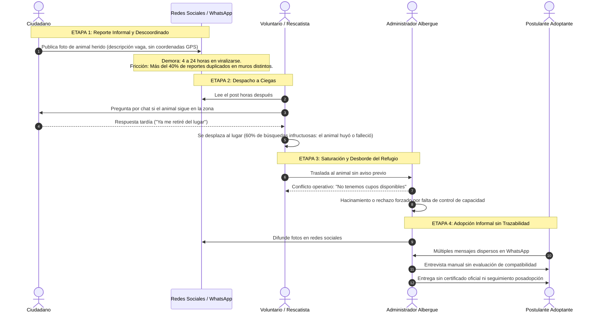
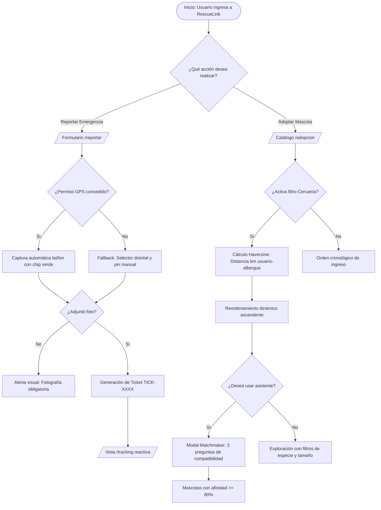

# 🖥️ RescueLink — Sustentación Oficial APF1
## Sistema de información web para la coordinación, seguimiento espacial y gestión de adopciones de animales en riesgo
**Curso Integrador II: Software (100000S12F) — Ciclo 2026-2**  
**Grupo 4:** Diego Claros · Pedro Cueto · Anghelo Mendoza · Elsa Riquelme  
**Incremento evaluado:** Hito 1 (APF1 - Arquitectura de Software y Front-End MVP)

[](https://angular.dev/)
[](https://www.figma.com/make/1zxQe5KPlpvTQizYrOPFLe/RescueLink-accessible-pet-adoption-site?t=TP9UcGP7XE97F57B-20&fullscreen=1)

---

## Portada institucional y organización del equipo
**Capítulo 1: Alineación y organización del equipo (Team Charter)**

### 1.1 Identificación del proyecto
* **Nombre oficial:** *RescueLink — Sistema de información web para la coordinación, seguimiento espacial y gestión de adopciones de animales en riesgo*.
* **Institución:** Universidad Tecnológica del Perú (UTP) · Facultad de Ingeniería de Sistemas.
* **Curso:** Curso Integrador II: Software (100000S12F) · Semestre Académico 2026-2.

### 1.2 Estructura del equipo de ingeniería y roles scrum
Distribución simétrica de responsabilidades técnicas y operativas con trazabilidad total en GitHub:

| Integrante | Rol Scrum Principal | Módulo Funcional Asignado | Historia Sprint 1 (APF1) | Responsabilidad Técnica Clave |
|---|---|---|:---:|---|
| **Diego Claros** | **Scrum Master & Lead Architect** | Módulo 1: Reporte Ciudadano | **HU01** (8 SP) | Arquitectura base Angular, ADRs y captura de coordenadas GPS. |
| **Pedro Cueto** | **Product Owner Simulado** | Módulo 2: Rescue Tracker | **HU02** (5 SP) | Backlog maestro, requerimientos BDD, cronograma Gantt y DoD. |
| **Anghelo Mendoza** | **Business Analyst & Developer** | Módulo 3: Catálogo Espacial | **HU03** (5 SP) | Flujo UX, modelo de datos sintéticos y algoritmo Haversine. |
| **Elsa Riquelme** | **QA Lead & UX Developer** | Módulo 4: Matchmaker & Calidad | **HU04** (5 SP) | Prototipado Figma, WCAG 2.1 AA, matriz PMBOK y auditoría WPO. |

### 1.3 Gobernanza del Equipo (Team Charter)
* **Cadencia Ágil:** Sprints bisemanales con sincronizaciones asíncronas diarias (*Daily Scrum*) en Discord y control de issues en GitHub Projects.
* **Disciplina de repositorio:** Modelo Git Flow con ramas protegidas, prohibición de commits directos a `desarrollo-frontend` y revisión por pares obligatoria.

---

## Diagnóstico empresarial (AS-IS), documentación de campo y causa raíz
**Capítulo 2: Diagnóstico de la realidad empresarial & Capítulo 3: Definición de la oportunidad**

### 2.1 Metodología de levantamiento de información y documentación de campo
La definición del problema se sustentó en un proceso riguroso de investigación documental y de campo:
* **Benchmarking competitivo:** Evaluación comparativa frente a plataformas de referencia, detectando fortalezas en catálogos pero una carencia crítica en la atención georreferenciada de emergencias.
* **Marco legal y regulatorio:**
  - **Ley N° 30407 (Ley de Protección y Bienestar Animal - Perú):** Obligatoriedad de promover la tenencia responsable, garantizar la trazabilidad sanitaria y evitar el maltrato por negligencia o hacinamiento.
  - **Ley N° 29733 (Ley de Protección de Datos Personales - Perú):** Resguardo estricto de la privacidad del ciudadano reportante (teléfono y nombre de uso exclusivo para auxilio inmediato).

### 2.2 Matriz de stakeholders (Poder vs. Interés)
Análisis estratégico de los actores clave del ecosistema de rescate y adopción:

| Stakeholder | Clasificación | Expectativas Principales | Poder | Interés | Estrategia de Gestión |
|---|---|---|:---:|:---:|---|
| **Ciudadano Reportante** | Externo / Usuario Final | Reportar un animal herido en < 30 s sin registros forzados y recibir confirmación del auxilio. | Bajo | Alto | Mantener informado / UX sin fricción |
| **Familia Adoptante** | Externo / Usuario Final | Conocer mascotas compatibles con su tipo de hogar y acceder a fichas sanitarias transparentes. | Bajo | Alto | Mantener satisfecho / Compatibilidad guiada |
| **Rescatista / Voluntario** | Interno / Operativo | Alertas con GPS exacto, fotos claras y confirmación de albergue receptor para no trasladarse en vano. | Medio | Alto | Gestionar de cerca / Co-diseño operativo |
| **Administrador de Albergue** | Interno / Gestión | Evitar el hacinamiento crítico, controlar la capacidad física y evaluar solicitudes con rigor. | Alto | Alto | Socio clave / Involucramiento total |

### 2.3 Mapeo del proceso actual (AS-IS) y puntos críticos de fricción


### 2.4 Análisis de causa raíz: Técnica de los "5 Porqués"
1. **¿Por qué los animales heridos en la calle no son auxiliados oportunamente?**  
   *Porque los albergues y rescatistas se enteran horas o días después mediante publicaciones desordenadas en redes sociales.*
2. **¿Por qué se enteran tarde mediante redes sociales?**  
   *Porque no existe un canal directo centralizado que conecte al ciudadano con el albergue disponible más cercano en tiempo real.*
3. **¿Por qué el ciudadano acude a redes sociales y no a un canal directo?**  
   *Porque las plataformas existentes exigen registros engorrosos, formularios extensos o no capturan la ubicación GPS exacta.*
4. **¿Por qué el ciudadano pierde interés en dar seguimiento al animal?**  
   *Porque nadie le informa si alguien fue a buscarlo, asumiendo con frustración que su alerta fue ignorada.*
5. **¿Por qué las organizaciones no informan al reportante ni coordinan eficazmente?**  
   **CAUSA RAÍZ:** *Porque carecen de un sistema de información web operativo centralizado que gestione el ciclo de vida del rescate mediante geolocalización en tiempo real, estados transparentes y trazabilidad pública.*

---

## Delimitación del MVP, Matriz de alcance y Decisiones arquitectónicas (ADRs)

### 3.1 Definición de la oportunidad y Product Goal
* **Enunciado de la oportunidad:** Reducir el tiempo de reporte a menos de 30 segundos, eliminar el despacho a ciegas de rescatistas mediante georreferenciación y transparentar el rescate y adopción de animales vulnerables.
* **Product Goal (Hito APF1):**  
  > *"Construir y desplegar un sistema web accesible, responsivo y de alto rendimiento que capture reportes georreferenciados de animales en riesgo en menos de 30 segundos sin fricción de registro, proporcione seguimiento reactivo en vivo y permita explorar mascotas en adopción ordenadas por cercanía física."*

### 3.2 Matriz de alcance: In-Scope vs. Out-of-Scope (MVP APF1 vs. Hitos posteriores)

| Capacidades Incluidas en el Alcance (In-Scope - APF1) | Capacidades Excluidas de esta Versión (Out-of-Scope) |
|---|---|:---:|
| Formulario de reporte ágil ciudadano con captura automática de GPS y vista previa de foto. | Pasarela de pagos bancarios reales para donaciones monetarias. |
| Línea de tiempo reactiva con visualización de estados en tiempo real. | Aplicación móvil nativa en tiendas Google Play / App Store (foco en Web Responsive). |
| Catálogo de adopción filtrable con ordenamiento esférico por proximidad (*"Cerca de mí"*). | Algoritmo de ruteo vehicular multi-parada en tiempo real para patrullas. |
| Test interactivo de compatibilidad en 3 pasos (*Matchmaker de Adopción*). | Reconocimiento biométrico facial o de pelaje por Inteligencia Artificial. |
| Directorio visual de albergues con indicador de capacidad disponible y datos de contacto. | Gestión de historias clínicas complejas con firma criptográfica PKI. |
| Manejo determinista de 5 estados UI (`idle`, `loading`, `success`, `empty`, `error`) con datos sintéticos locales. | Conexión a base de datos persistente concurrente (Spring Boot + PostgreSQL/PostGIS). |

### 3.3 Supuestos y restricciones del proyecto
* **Supuesto Clave:** El 90% de los ciudadanos que reportan en la calle utilizan navegadores móviles con sensor GPS operativo.

---

## Catálogo Formal de Requerimientos (RF, RNF y Reglas de Negocio)
**Capítulo 4: Elicitación de Requerimientos e Historias de Usuario**

### 4.1 Requerimientos Funcionales (RF)
* **RF01 (Reporte Ágil de Emergencia):** El sistema debe permitir al usuario enviar un reporte de emergencia ingresando nombre, WhatsApp, fotografía del animal y captura de coordenadas GPS del dispositivo.
* **RF02 (Rescue Tracker en Vivo):** El sistema debe permitir consultar la línea de tiempo del rescate ingresando el código único de ticket alfanumérico generado.
* **RF03 (Catálogo Geodésico de Adopción):** El sistema debe presentar un catálogo de adopción filtrable por especie, tamaño y cercanía geográfica respecto a la posición actual del usuario calculada por fórmula esférica.
* **RF04 (Asistente Matchmaker de Compatibilidad):** El sistema debe incorporar un asistente interactivo de 3 preguntas que filtre las mascotas según el estilo de vida y vivienda del adoptante.
* **RF05 (Directorio Geográfico de Albergues):** El sistema debe desplegar un directorio de albergues con su ubicación, datos de contacto y semáforo de disponibilidad de cupos.
* **RF06 (Detección Preventiva de Duplicados):** El sistema debe detectar automáticamente posibles reportes duplicados dentro de un radio espacial de 50 metros registrados en las últimas 2 horas.
* **RF07 (Postulación Formal a Adopción):** El sistema debe permitir a las familias adoptantes postular a la adopción de una mascota completando un formulario de idoneidad y compromiso ético.
* **RF08 (Muro de Evidencia Social - Finales Felices):** El sistema debe presentar un muro de testimonios con un componente slider comparativo interactivo Antes vs. Después.

### 4.2 Requerimientos No Funcionales (RNF)
* **RNF01 (Rendimiento Front-End / WPO):** El Largest Contentful Paint (LCP) en navegación móvil 4G simulada debe ser menor a **2.5 segundos** y el Cumulative Layout Shift (CLS) inferior a **0.1**.
* **RNF02 (Accesibilidad Web WCAG 2.1 AA):** Toda la interfaz debe cumplir con las directrices WCAG 2.1 nivel AA, garantizando un ratio de contraste mínimo de **4.5:1** y navegación íntegra por teclado.
* **RNF03 (Diseño Responsivo Mobile-First):** La aplicación debe adaptarse de manera fluida desde un ancho mínimo de **320 px** hasta pantallas 4K sin generar desbordamiento ni scroll horizontal.
* **RNF04 (Manejo de Estados Determinista):** Cada vista interactiva debe manejar de forma tipada e inequívoca los estados de interfaz: `idle`, `loading`, `success`, `empty` y `error`.

### 4.3 Reglas de Negocio Formales (RN)
* **RN01 (Reporte sin Barreras):** No se exigirá inicio de sesión ni creación de cuenta previa para registrar una emergencia en la vía pública.
* **RN02 (Control de Sobrecupo en Albergues):** Un albergue cuya capacidad activa alcance el 100% no podrá recibir nuevas asignaciones automáticas de rescate.
* **RN03 (Resolución de Solicitudes Concurrentes):** Múltiples usuarios pueden postular al mismo animal; al aprobarse formalmente una adopción, las demás solicitudes asociadas pasan al estado `CERRADA_POR_OTRA_ADOPCION`.
* **RN04 (Umbral Espacial de Duplicados):** Dos reportes ocurridos a menos de **50 metros** de distancia y con una diferencia de tiempo menor a **120 minutos** se consideran presuntos duplicados y disparan una alerta de confirmación.
* **RN05 (Inmutabilidad del Historial Clínico):** Los registros veterinarios y de vacunación son de solo inserción/lectura y no pueden ser eliminados del sistema.
* **RN06 (Privacidad del Ciudadano):** Los datos personales del reportante solo son visibles para el personal asignado al auxilio y se ocultan de las vistas públicas conforme a la Ley 29733.

---

## Product Backlog Maestro (16 Historias de Usuario) y Planificación Sprint 1

### 5.1 Matriz Maestra del Product Backlog (16 Historias · 55 Story Points)
Distribución equitativa: exactamente **4 Historias de Usuario por integrante** (1 HU por hito evaluativo):

| ID | Historia de Usuario | Integrante Responsable | Hito Evaluativo | Estimación | Prioridad MoSCoW | Rama de Trabajo Git |
|:---:|---|---|:---:|:---:|:---:|---|
| **HU01** | Reporte Ágil con Captura GPS y Foto | **Diego Claros** | **APF1 (Sprint 1)** | **8 SP** | Must Have | `feat/HU-01-reporte-agil-gps` |
| **HU02** | Rescue Tracker de Seguimiento en Vivo | **Pedro Cueto** | **APF1 (Sprint 1)** | **5 SP** | Must Have | `feat/HU-02-rescue-tracker` |
| **HU03** | Catálogo Ordenado por Proximidad GPS | **Anghelo Mendoza** | **APF1 (Sprint 1)** | **5 SP** | Must Have | `feat/HU-03-catalogo-cercania-gps` |
| **HU04** | Matchmaker Interactivo de Compatibilidad | **Elsa Riquelme** | **APF1 (Sprint 1)** | **3 SP (+2 QA)** | Should Have | `feat/HU-04-matchmaker-wizard` |
| **HU05** | Detección Preventiva de Duplicados PostGIS | Anghelo Mendoza | APF2 (Sprint 2) | 5 SP | Should Have | `feat/HU-05-deteccion-duplicados` |
| **HU07** | Directorio Geográfico de Albergues Aliados | Elsa Riquelme | APF2 (Sprint 2) | 2 SP | Could Have | `feat/HU-07-directorio-albergues` |
| **HU09** | Autenticación Segura JWT y Roles de Usuario | Diego Claros | APF2 (Sprint 2) | 3 SP | Must Have | `feat/HU-09-auth-jwt-roles` |
| **HU10** | Bandeja Operativa y Asignación de Refugios | Pedro Cueto | APF2 (Sprint 2) | 4 SP | Must Have | `feat/HU-10-bandeja-rescates` |
| **HU06** | Postulación a Adopción con Formulario | Anghelo Mendoza | APF3 (Sprint 3) | 3 SP | Must Have | `feat/HU-06-postulacion-adopcion` |
| **HU11** | Ficha Clínica, Historial Médico y Cuarentena | Elsa Riquelme | APF3 (Sprint 3) | 3 SP | Must Have | `feat/HU-11-ficha-clinica-cuarentena` |
| **HU12** | Control de Capacidad y Alertas de Sobrecupo | Pedro Cueto | APF3 (Sprint 3) | 2 SP | Should Have | `feat/HU-12-control-capacidad` |
| **HU14** | Emisión de Certificado PDF con Código QR | Diego Claros | APF3 (Sprint 3) | 3 SP | Must Have | `feat/HU-14-certificado-pdf-qr` |
| **HU08** | Muro de Finales Felices (Slider Comparativo) | Elsa Riquelme | PROY (Sprint 4) | 2 SP | Could Have | `feat/HU-08-muro-finales-felices` |
| **HU13** | Evaluación Comparativa y Dictamen de Postulantes | Anghelo Mendoza | PROY (Sprint 4) | 2 SP | Should Have | `feat/HU-13-dictamen-adopcion` |
| **HU15** | Despacho y Confirmación Móvil en Campo | Pedro Cueto | PROY (Sprint 4) | 3 SP | Should Have | `feat/HU-15-despacho-voluntarios` |
| **HU16** | Portal Público de Verificación Criptográfica QR | Diego Claros | PROY (Sprint 4) | 2 SP | Could Have | `feat/HU-16-verificacion-qr` |

### 5.2 Planificación del Sprint 1 (APF1)
* **Velocidad Comprometida del Sprint 1:** **21 Story Points**.
* **Objetivo del Sprint 1:** Entregar el primer incremento funcional del cliente web, permitiendo reportar emergencias con geolocalización, rastrear el auxilio y explorar adopciones por cercanía.

---

## Especificaciones e Historias de usuario prioritarias

### 6.1 HU01: Reporte Ágil de Emergencia con Ubicación GPS (Diego Claros)
```gherkin
Escenario 1: Reporte exitoso con captura automática de GPS (Happy Path)
  Dado que el ciudadano accede al formulario en "/reportar"
  Y el dispositivo tiene los permisos de geolocalización habilitados
  Cuando ingresa su nombre "Carlos Ruiz", WhatsApp "987654321" y adjunta una foto
  Y presiona el botón "Enviar Reporte de Emergencia"
  Entonces el sistema captura latitud y longitud automáticamente con precisión < 15 m
  Y emite un código de ticket único alfanumérico (ej. "TICK-1024")
  Y redirige de inmediato a la vista de tracking en vivo.

Escenario 2: Fallback manual ante permiso de geolocalización denegado
  Dado que el ciudadano ingresa al formulario con el GPS desactivado
  Cuando el navegador reporta el error "PERMISSION_DENIED"
  Entonces el sistema no bloquea el envío de la emergencia
  Y activa un selector distrital desplegable con opción de posicionamiento manual
  Y marca las coordenadas del centroide distrital con un indicador visual amarillo.
```

### 6.2 HU02: Rescue Tracker de Seguimiento en Vivo (Pedro Cueto)
```gherkin
Escenario 1: Consulta exitosa de ticket válido en curso
  Dado que el usuario accede a la vista "/tracking"
  Cuando ingresa el código "TICK-1024" y hace clic en "Consultar Estado"
  Entonces el sistema renderiza la línea de tiempo reactiva del rescate
  Y muestra el estado actual ("EN_CAMINO"), nombre del albergue y hora estimada de llegada.

Escenario 2: Consulta de código de ticket inexistente
  Dado que el usuario consulta un código no registrado en el sistema
  Cuando se completa la búsqueda
  Entonces el sistema muestra una pantalla amigable de estado vacío (Empty State)
  Y proporciona un botón para verificar el código o iniciar un nuevo reporte.
```

### 6.3 HU03: Catálogo de Adopción Ordenado por Proximidad (Anghelo Mendoza)
```gherkin
Escenario 1: Ordenamiento geodésico dinámico por cercanía física
  Dado que el usuario se encuentra en el catálogo "/adopcion"
  Y ha compartido su ubicación GPS actual
  Cuando activa el switch "📍 Ordenar por cercanía a mi posición"
  Entonces el sistema calcula la distancia ortodrómica a cada albergue mediante Haversine
  Y ordena la cuadrícula de mascotas en orden ascendente de kilómetros
  Y muestra la etiqueta con la distancia calculada en cada tarjeta (ej. "A 2.4 km de ti").
```

### 6.4 HU04: Asistente Interactivo de Compatibilidad (Elsa Riquelme)
```gherkin
Escenario 1: Adoptante completa el cuestionario de compatibilidad
  Dado que el usuario abre el modal del asistente Matchmaker
  Cuando responde las 3 preguntas (tipo de vivienda, horas fuera de casa y nivel de actividad)
  Entonces el sistema calcula el índice de compatibilidad porcentual [0-100%]
  Y filtra el catálogo mostrando en primer lugar a los animales con afinidad >= 80%.
```

---

## Diseño UX/UI, prototipo interactivo en Figma y validación de usabilidad

### 7.1 Prototipo interactivo oficial en Figma
* **Acceso directo al prototipo:**  
  🔗 [https://www.figma.com/make/1zxQe5KPlpvTQizYrOPFLe/RescueLink-accessible-pet-adoption-site?t=TP9UcGP7XE97F57B-20&fullscreen=1](https://www.figma.com/make/1zxQe5KPlpvTQizYrOPFLe/RescueLink-accessible-pet-adoption-site?t=TP9UcGP7XE97F57B-20&fullscreen=1)

### 7.2 Sistema de diseño y biblioteca de componentes UI
* **Tokens de diseño:** Colores con semántica accesible (Verde `#059669` para estados confirmados, Ámbar `#D97706` para atención pendiente, Rojo `#DC2626` para urgencias críticas).
* **Tipografía:** Jerarquía tipográfica basada en *Outfit* para títulos institucionales e *Inter* para lectura operativa en pantallas móviles.
* **Matriz de estados de componentes:** Cada elemento UI interactivo (botones, inputs, cards) cuenta con especificaciones para: `Default`, `Hover`, `Focus-Visible`, `Active`, `Disabled`, `Loading` y `Empty`.

### 7.3 Validación temprana: Prueba de usabilidad
Evaluación con usuario representativo externo ejecutando 3 tareas críticas en el prototipo Figma:

| Tarea Evaluada | Hallazgo / Fricción Detectada | Corrección de Diseño Aplicada en Front-End |
|---|---|---|
| **1. Reporte en Calle** | El usuario dudaba si el teléfono había capturado el GPS con exactitud. | Se incorporó un **Chip visual de confirmación GPS** que se torna verde con las coordenadas capturadas. |
| **2. Consulta de Tracker** | Dificultad para memorizar el código alfanumérico del ticket generado. | Se implementó un **Botón de copiado en un clic** del ticket con feedback visual (*"¡Copiado!"*). |
| **3. Exploración de Adopción** | No se distinguía qué albergue albergaba a la mascota ni la lejanía. | Se añadió la **Etiqueta destacada de distancia en km** y nombre del albergue en la tarjeta. |

---

## Flujo de usuario (user flow) y algoritmo geodésico espacial

### 8.1 Diagrama del flujo de usuario (user flow)

---

## Arquitectura Front-End Standalone, Smart/Dumb Components

### 9.1 Paradigma Angular Standalone con Signals
* **Sin `NgModule` Legacy:** Arquitectura 100% modular basada en componentes Standalone (`standalone: true`), reduciendo el tamaño del bundle inicial y permitiendo tree-shaking exhaustivo.
* **Reactividad Nativa con Signals:** Reemplazo de observables complejos de RxJS por primitivos reactivos: `signal()`, `computed()` y `effect()`. Garantiza que los cambios de estado solo actualicen el nodo DOM exacto.

### 9.2 Patrón de componentes Smart & Dumb (separación de responsabilidades)
* **Contenedores Smart (Lógica de Negocio):**  
  Componentes como `CatalogContainerComponent` y `ReportContainerComponent`. Inyectan servicios, manejan llamadas a datos sintéticos, calculan el estado reactivo y gestionan la navegación.
* **Componentes Dumb (Presentacionales y Reutilizables):**  
  Componentes como `PetCardComponent`, `TrackerTimelineComponent`, `GpsBadgeComponent` y `MatchmakerWizardComponent`. No poseen dependencias de servicios; se comunican estrictamente mediante `input()` y emiten eventos al padre mediante `output()`.

---

## Control de ingeniería en GitHub, Git Flow y Criterios DoD / DoR

### 10.1 Estructura del repositorio GitHub (`Integrador2G4`)
* **Organización Limpia:**
  - `ProyectoFinal/frontend/`: Aplicación Angular Standalone con código fuente, assets y tests.
  - `Laboratorios/`: Evidencias individuales de aprendizaje práctico de los 4 integrantes.
  - `Sesiones/`: Presentaciones oficiales de clase y materiales de sustentación por sesión.

### 10.2 Estrategia de ramas Git Flow y matriz de revisión por pares
* **Ramas protegidas:** Ramas `main` y `desarrollo-frontend` protegidas contra commits directos.
* **Matriz cruzada de aprobación de pull requests:**
  - `Diego Claros` $\rightarrow$ Revisa los PRs de `Pedro Cueto`.
  - `Pedro Cueto` $\rightarrow$ Revisa los PRs de `Anghelo Mendoza`.
  - `Anghelo Mendoza` $\rightarrow$ Revisa los PRs de `Elsa Riquelme`.
  - `Elsa Riquelme` $\rightarrow$ Revisa los PRs de `Diego Claros`.

### 10.3 Criterios de calidad: Definition of Ready (DoR) vs. Definition of Done (DoD)
* **Definition of Ready (DoR):** Historia con narrativa de usuario, estimación acordada en Planning y mockup Figma aprobado.
* **Definition of Done (DoD):**
  1. Código TypeScript bajo modo estricto.
  2. Pruebas unitarias automatizadas (`npm test`) pasando al 100% de éxito.
  3. Pull Request revisado y aprobado por el par asignado en la matriz.
  4. Rama de feature eliminada tras el merge a `desarrollo-frontend`.

---

## Gestión cuantitativa de riesgos PMBOK

### 11.1 Estructura del desglose de riesgos (RBS)
* **Técnicos:** Incompatibilidad de geolocalización móvil, incremento desmedido del bundle web.
* **Gestión:** Cuellos de botella en revisiones por pares, desalineación con el Product Backlog.
* **Operativos / UX:** Abandono del reporte por lentitud de red, desbordamiento en pantallas pequeñas.
* **Normativos:** Incumplimiento de la Ley 29733 de Protección de Datos Personales.

---

## Métricas de Negocio (KPIs), Métricas Técnicas (SLIs) y Acuerdos de Nivel de Servicio (SLA)

### 12.1 Separación Formal: Indicadores de Negocio (KPI) vs. Indicadores Técnicos (SLI)
```
                          [ PLATAFORMA RESCUELINK ]
                                      │
          ┌───────────────────────────┴───────────────────────────┐
          ▼                                                       ▼
  [ KPIs DE NEGOCIO Y SOCIALES ]                          [ SLIs DE INGENIERÍA ]
  (Impacto en Rescate y Adopción)                         (Calidad de Software y Plataforma)
    • KPI-01: Tiempo Medio de Auxilio                       • SLI-01: Largest Contentful Paint (LCP)
    • KPI-02: Tasa de Duplicados Bloqueados                 • SLI-02: Interaction to Next Paint (INP)
    • KPI-03: Tasa de Conversión de Adopción                • SLI-03: Cumulative Layout Shift (CLS)
    • KPI-04: Satisfacción del Usuario                      • SLI-04: Disponibilidad del Servicio HTTP
```

* **Definición de métricas clave:**
* **Tasa de Duplicados Bloqueados:** Mide el porcentaje de reportes que son bloqueados por el sistema.
* **Tasa de Conversión de Adopción:** Mide el porcentaje de postulaciones que resultan en adopciones exitosas.
* **Tiempo Medio de Asignación de Rescate:** Mide el tiempo en que se asigna un rescate a un voluntario.

* **LCP (Largest Contentful Paint):** Mide el tiempo en que se renderiza el elemento de contenido más grande. Sirve para evaluar la percepción de velocidad de carga.
* **INP (Interaction to Next Paint):** Mide la latencia de todas las interacciones del usuario con la página. Sirve para evaluar la capacidad de respuesta de la interfaz.
* **CLS (Cumulative Layout Shift):** Mide la suma de todos los desplazamientos inesperados de diseño. Sirve para evaluar la estabilidad visual.
* **Disponibilidad:** Mide el porcentaje de tiempo en que la plataforma está operativa.

### 12.2 Acuerdo Formal de Nivel de Servicio (SLA)
> **Acuerdo de Nivel de Servicio (SLA) - RescueLink v1.0**  
> 1. **Compromiso de Disponibilidad:** RescueLink garantiza a los albergues y a la comunidad una disponibilidad mensual no menor al **$99.0\%$**, excluyendo ventanas de mantenimiento programado comunicadas con 48 h de anticipación.  
> 2. **Compromiso de Latencia:** La carga interactiva del formulario de reporte responderá en menos de **$2.5\text{ segundos}$** en el 95% de las peticiones móviles.  
> 3. **Plan de Contingencia y Compensación:** Ante una indisponibilidad no planificada que supere el Error Budget mensual, se activa inmediatamente el canal de contingencia asistido vía **Bot de WhatsApp** para garantizar que ninguna alerta de emergencia se pierda.

---

## Demostración en Vivo del MVP Front-End (Sprint 1 en Ejecución)

### 13.1 Entorno Local de Ejecución
* **Servidor de Desarrollo:** Node.js v22 + Angular CLI 19+ corriendo en `http://localhost:4200/`.
* **Herramientas de Auditoría Abiertas:** Google Chrome DevTools con panel de Consola (cero advertencias/errores) y emulador móvil a **320 px** de ancho.

### 13.2 Flujo Guiado de Demostración Técnica en Vivo
1. **Flujo de Reporte de Emergencia (`/reportar`):**
   * Diligenciamiento de nombre y WhatsApp con validación reactiva de 9 dígitos.
   * Adjunto de fotografía con preview instantáneo y compresión en cliente.
   * Captura automática de coordenadas con encendido del **Chip GPS Verde**.
   * Envío del formulario y emisión inmediata del ticket alfanumérico (`TICK-1024`).
2. **Flujo de Trazabilidad en Vivo (`/tracking`):**
   * Consulta del ticket generado evidenciando la **Línea de Tiempo Reactiva**.
   * Transición visual de hitos (`REPORTADO` $\rightarrow$ `EN_CAMINO` $\rightarrow$ `EN_REFUGIO`).
   * Prueba de error: Consulta de ticket inexistente desplegando el **Empty State ilustrado**.
3. **Flujo de Catálogo Espacial y Adopción (`/adopcion`):**
   * Activación del switch *"📍 Ordenar por cercanía a mi posición"*.
   * Recálculo instantáneo de distancias mediante **Haversine puro** con distancias mostradas en cada tarjeta.
   * Interacción con el asistente **Matchmaker** cargado diferidamente.

---