# 🐾 RescueLink — Sustentación Oficial APF2 (Avance de Proyecto Final 2)
## Sistema Web para Coordinación, Auxilio Geográfico y Adopción de Animales en Riesgo

**Curso:** Integrador II: Software (Ciclo 2026-2)  
**Grupo 4:** Diego Claros · Pedro Cueto · Anghelo Mendoza · Elsa Riquelme
**Estado:** Desplegado en nube

---

## 1. Diagrama Maestro de Arquitectura Integral

```mermaid
flowchart TB
%% =========================================================================
%% 1. ACTORES Y CANALES
%% =========================================================================
    subgraph ACT["👥 1. ACTORES DEL SISTEMA"]
        direction LR
        U_CIU["👤 Ciudadano\n(Sin registro obligatorio)"]
        U_VOL["🚗 Voluntario / Rescatista\n(Atención en campo)"]
        U_ADM["🛡️ Administrador\n(Gestión del albergue)"]
    end

%% =========================================================================
%% 2. FRONTEND CLOUD (VERCEL)
%% =========================================================================
    subgraph FRONT["🌐 2. FRONTEND WEB — Angular 19 en Vercel (CDN Global + HTTPS)"]
        direction TB
        F_CORE["⚡ Angular 19 Standalone\nReactividad con Signals (Rápido y liviano)"]
        
        subgraph F_MODULOS["Pantallas Principales de la Aplicación"]
            direction LR
            M_REP["🚨 Reporte Ágil\n(GPS + Foto del animal)"]
            M_TRA["🔍 Rescue Tracker\n(Seguimiento con código)"]
            M_CAT["🐶 Catálogo Adopciones\n(Botón 'Cerca de mí')"]
            M_WIZ["✨ Matchmaker\n(Test de compatibilidad)"]
            M_ALB["🏠 Albergues y Donaciones\n(Aforo en tiempo real)"]
            M_BAN["📋 Bandeja Operativa\n(Despacho y asignación)"]
        end
        
        F_ROUTER["🧭 Enrutamiento SPA y Filtro de Seguridad"]
        F_PROXY["🔀 vercel.json (Redirige /api/* a Render automáticamente)"]
    end

%% =========================================================================
%% 3. BACKEND CLOUD (RENDER)
%% =========================================================================
    subgraph BACK["⚙️ 3. BACKEND API — Spring Boot 3.4 + Java 21 en Render (Docker)"]
        direction TB
        B_CONTAINER["🐳 Contenedor Docker\n(Java 21 liviano en Linux Alpine, menos de 190 MB)"]
        
        subgraph B_SEGURIDAD["Seguridad y Control de Acceso (HU09)"]
            direction LR
            S_JWT["🔐 Llave Digital JWT\n(Token temporal de 15 min)"]
            S_ROLES["🛡️ Control de Roles\n(Ciudadano, Voluntario, Admin)"]
            S_RESP["📋 Errores Claros y Limpios\n(Sin mostrar código interno)"]
        end

        subgraph B_LOGICA["Reglas del Negocio y Lógica de Auxilio"]
            direction LR
            L_DUPLI["🛑 Anti-Duplicados (HU05)\nBloquea reportes a menos de 50 metros"]
            L_ASIG["🧭 Auto-Asignación (HU01)\nBusca el albergue a menos de 10 km"]
            L_ORD["📍 Orden por Cercanía (HU10)\nOrdena los tickets del más cercano al más lejano"]
            L_CAP["📊 Control de Cupos (HU10)\nAlerta si el albergue no tiene espacio"]
        end

        subgraph B_OBSERVA["Monitoreo y Documentación Oficial"]
            direction LR
            O_SWAG["📖 Swagger UI en la Nube\n(Pruebas interactivas)"]
            O_HEAL["💓 Actuator Health\n(Semáforo de salud de la base de datos)"]
        end
    end

%% =========================================================================
%% 4. BASE DE DATOS CLOUD (SUPABASE)
%% =========================================================================
    subgraph BD["🗄️ 4. BASE DE DATOS ESPACIAL — PostgreSQL 17 + PostGIS en Supabase"]
        direction TB
        BD_MOTOR["🐘 PostgreSQL 17 + PostGIS\n(Base de datos con motor de mapas y distancias métricas)"]
        BD_FLYWAY["🚀 Flyway Migrations\n(Crea las tablas y llena datos de prueba automáticamente)"]
        
        subgraph BD_TABLAS["Las 7 Tablas del Negocio"]
            direction TB
            T1["1. usuarios (Cuentas, roles y contraseñas encriptadas)"]
            T2["2. albergues (Punto GPS, capacidad y distrito)"]
            T3["3. tickets_rescate (Emergencias activas, estado y ubicación)"]
            T4["4. animales (Mascotas listas para adopción)"]
            T5["5. historial_clinico (Revisiones veterinarias)"]
            T6["6. solicitudes_adopcion (Postulaciones ciudadanas)"]
            T7["7. donaciones (Aportes de alimento balanceado o dinero)"]
        end

        BD_VIEW["👁️ Vista SQL de Capacidad\n(Calcula el porcentaje de ocupación al instante)"]
    end

%% =========================================================================
%% CONEXIONES Y FLUJO DE DATOS
%% =========================================================================
    U_CIU -->|Reporta o busca mascota| M_REP
    U_CIU -->|Consulta avance| M_TRA
    U_CIU -->|Verifica albergues| M_ALB
    U_VOL -->|Atiende el caso| M_BAN
    U_ADM -->|Revisa cupos| M_BAN

    F_MODULOS --> F_CORE
    F_CORE --> F_ROUTER
    F_ROUTER --> F_PROXY

    F_PROXY -->|Túnel seguro HTTPS /api/*| B_CONTAINER

    B_CONTAINER --> B_SEGURIDAD
    B_CONTAINER --> B_LOGICA
    B_CONTAINER --> B_OBSERVA

    B_LOGICA -->|Consulta distancias y guarda datos| BD_MOTOR
    BD_FLYWAY -->|Siembra tablas y datos semilla| BD_TABLAS
    BD_TABLAS --> BD_VIEW
    BD_VIEW -.->|Devuelve ocupación| B_LOGICA

%% Estilos visuales sencillos y profesionales
    classDef actorStyle fill:#EBF5FB,stroke:#2980B9,stroke-width:2px,color:#1B4F72;
    classDef frontStyle fill:#FADBD8,stroke:#C0392B,stroke-width:2px,color:#78281F;
    classDef backStyle fill:#D5F5E3,stroke:#27AE60,stroke-width:2px,color:#145A32;
    classDef bdStyle fill:#E8DAEF,stroke:#8E44AD,stroke-width:2px,color:#4A235A;

    class U_CIU,U_VOL,U_ADM actorStyle;
    class F_CORE,F_PROXY,M_REP,M_TRA,M_CAT,M_WIZ,M_ALB,M_BAN,F_ROUTER frontStyle;
    class B_CONTAINER,S_JWT,S_ROLES,S_RESP,L_DUPLI,L_ASIG,L_ORD,L_CAP,O_SWAG,O_HEAL backStyle;
    class BD_MOTOR,BD_FLYWAY,T1,T2,T3,T4,T5,T6,T7,BD_VIEW bdStyle;
```

---

## 2. Enlaces

| Recurso | Enlace Cloud Oficial | Qué demuestra |
| :--- | :--- | :--- |
| **Aplicación Web (Frontend)** | *Tu dominio en Vercel* (ej. `https://rescuelink.vercel.app`) | Portal ciudadano, reportes, adopciones y bandeja operativa en vivo. |
| **Swagger UI Oficial (API)** | [https://rescuelink-backend-xirg.onrender.com/swagger-ui/index.html](https://rescuelink-backend-xirg.onrender.com/swagger-ui/index.html) | Documentación interactiva de todos los endpoints protegidos y públicos. |
| **Semáforo de Salud (Actuator)** | [https://rescuelink-backend-xirg.onrender.com/actuator/health](https://rescuelink-backend-xirg.onrender.com/actuator/health) | Conectividad saludable y en tiempo real con PostgreSQL en Supabase. |
